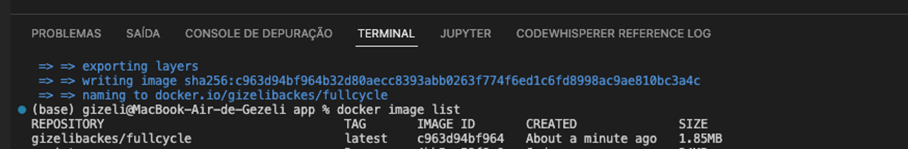
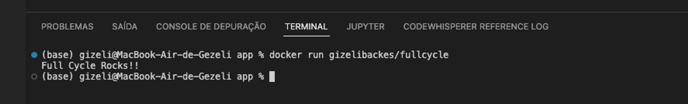

# Publicar uma imagem no docker hub

Esse desafio é muito empolgante principalmente se você nunca trabalhou com a linguagem Go!

Você terá que publicar uma imagem no docker hub. Quando executarmos:

docker run <seu-user>/fullcycle

Temos que ter o seguinte resultado: Full Cycle Rocks!!

Se você perceber, essa imagem apenas realiza um print da mensagem como resultado final, logo, 
vale a pena dar uma conferida no próprio site da Go Lang para aprender como fazer um "olá mundo".

Lembrando que a Go Lang possui imagens oficiais prontas, vale a pena consultar o Docker Hub.
A imagem de nosso projeto Go precisa ter menos de 2MB =)

Suba o projeto em um repositório Git remoto e coloque o link da imagem que subiu no Docker Hub.

Compartilhe o link do repositório do Git remoto para corrigirmos seu projeto.

Divirta-se!

# Dockerfile

```
FROM golang:alpine AS stage1

WORKDIR /app
COPY    /app .

RUN apk add --no-cache go
RUN go build main.go

FROM scratch AS stage2
WORKDIR /app
COPY --from=stage1 /app .
CMD ["./main"]
```
  
# Build 

```
docker build -t <seu-user>/fullcycle
```

## Images

```
docker images
```


# Run

```
docker run <seu-user>/fullcycle
```


# Docker login

```
docker login
```
# Push

```
docker push <seu-user>/fullcycle
```
# Pull

```
docker pull <seu-user>/fullcycle
```

## Referências
- http://goporexemplo.golangbr.org/hello-world.html
- https://hub.docker.com/_/scratch/
- https://hub.docker.com/_/golang/
